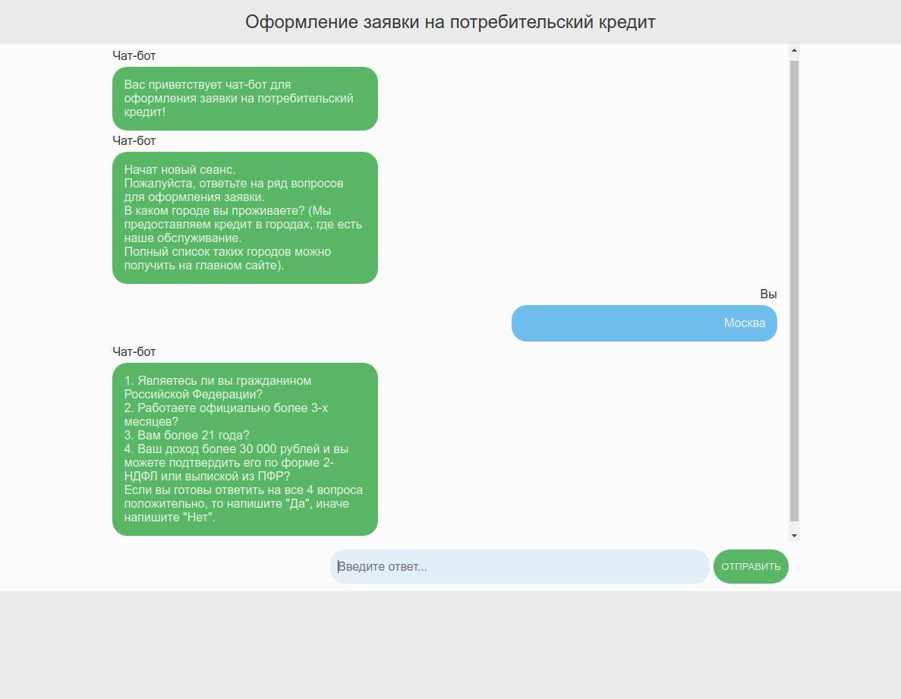

## Чат-бот для оформления заявки на потребительский кредит





## В проекте используются
- *Java 1.8.x*
- *Maven 4.x.x*


## Общая информация
Приложение имеет клиент-серверную архитектуру.
Для обмена сообщений между клиентом и сервером используется протокол *STOMP* поверх *WebSocket* 
(а также *SockJS* в качестве резервного варианта в случае отсутствия поддержки *WebSocket*).

Для реализации клиента был написан простой скрипт на *JavaScript*, который соединяется с сервером, подписывается на сообщения из канала для пользователя, отправляет сообщения в канал и получает их оттуда.

На стороне сервера используется *Spring Boot*. 


## Чат-бот
Чат-бот задает несколько вопросов, формируя на их основе заявку. После успешного формирования заявки текущее соединение считается завершенным,
и для формирования новой заявки нужно создать новую сессию. 

Чат-бот последовательно задает вопросы, собирая нужные ответы пользователя в базе данных. Причем в случае если пользователь отвечает неверными данными (данными некорректного формата),
чат-бот сообщает об этом и просит заново ввести данные. 
Кроме того в этом же сообщении предусмотрена специальная команда, позволяющая пользователю завершить текущий сеанс общения и начать новый, не создавая новое соединение.

В случае неудовлетворения условиям программы кредитования чат-бот сообщает об этом пользователю, завершая текущий сеанс общения и позволяя пользователю начать новый без создания нового соединения. 

Для обработки города клиента, чтобы понять, обслуживает ли банк его город, используется обычный список из городов, 
где есть отделения банка. В реальном проекте для этого можно использовать некоторую БД, содержащую список таких городов.

Для тех данных, которые можно проверить, проводится проверка формата введенных данных с помощью регулярных выражений.
Кроме того, дополнительно обрабатываются границы допустимых значений для таких данных, как срок кредита, сумма, процентная ставка. 
Также дополнительная проверка проводится на возраст.


## Реализация
Одновременно может быть открыто несколько сессий чат-бота с пользователями.
Переопределяется объект `Principal` (используемый в *Spring* для хранения информации о текущем пользователе), которому добавляется специальное строковое поле `name`.
Соответственно, для идентификации WebSocket-соединения для каждого пользователя генерируется уникальная строка, помещаемая в поле `name` объекта `Principal` на этапе установки соединения, 
а также создается сущность `ChatBot`, представляющая чат-бота для конкретного пользователя. 

Реализован конечный автомат возможных состояний бота (`ChatBotState`) и переходы между ними.

Для обработки всех сообщений используется встроенный `WebSocketMessageBroker`
который управляет очередью сообщений.

Установка соединения для клиента начинается с отправки запроса на `/join`. После успешного соединения ча-бот присылает приветственное сообщение и первый вопрос, начиная сеанс общения.
Каждый клиент посылает сообщение в свой канал, которое обрабатывается контроллером на `/send`, где происходит формирование ответа и отправка сообщений 
(сообщение самого пользователя и ответ на него чат-бота) непосредственно клиенту. 

Чтобы сохранять данные о пользователе (заявку), использована простая *in-memory* база данных *H2*.
Это сделано для облегчения запуска приложения. Данные не будут сохранены после завершения работы приложения. На каждый запуск будет создаваться новая БД
(это сделано для максимально удобной демонстрации работы приложения; тем не менее обычная *SQL* БД легко может быть добавлена вместо *H2*, просто в таком случае потребуется больше действий для запуска). 

В БД создается сущность на каждое соединение. Причем запись остается в базе только в случае, если клиент успешно оформил заявку.
Иначе запись удаляется после разрыва соединения.
В случае начала нового сеанса общения БД также создается новый пользователь, а старый будет удален. При этом текущее соединение не разрывается.

Стоит отметить, что построенная архитектура позволяет легко добавлять новые состояния бота и обработку дополнительных полей.


## Установка и запуск
1. Клонировать приложение
`git clone https://github.com/Stranger488/credit-chat-bot.git`
2. Собрать и запустить приложение с помощью Maven
```
cd credit-chat-bot
mvn package
java -jar target/credit-chat-bot-0.0.1-SNAPSHOT
```

Приложение доступно по адресу *http://localhost:8080*

Консоль *H2* доступна по адресу *http://localhost:8080/h2*
(данные для входа в нее доступны в файле *application.properties*)
